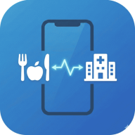

# アレログ (Allergy Log)

食事と病院をスマホでつなぐ、アレルギー症状記録PWA（Progressive Web App）です。

**Version:** 1.3.6

  

## 📌 コンセプト
**「記録は簡単に、診断は的確に」**

* **患者さんの負担を最小限に:** * 食事は写真を撮るだけ。
    * 服薬は最初に登録した薬剤を選ぶだけ。
    * 毎日の入力を極限まで簡便にすることで、継続率を高めます。
* **「証拠」を自動保存:**
    * 症状を入力した際、**「設定された遡り日数分の食事と服薬の記録」**を自動的にパッケージ化して保存します。後から食事ログを整理しても、診断に必要なデータは消えません。

## 👨‍⚕️ ドクターモード
医師とのコミュニケーションを支援する専用モードを搭載しています。

* **使い方:** 画面右上の 🏥（病院アイコン）をタップします。
* **機能:**
    * **カレンダー:** 症状が出た日だけが強調され、重症度（1〜5）が数字で表示されます。頻度と強さがひと目でわかります。
    * **タイムライン:** 症状の記録のみがフィルタリング表示されます。
    * **詳細確認:** 記録をタップすると、発症直前の設定された遡り日数分の「何を食べていたか」「薬を飲んでいたか」を即座に確認できます。

## 📱 機能一覧
1.  **食事記録:** カメラ撮影またはアルバム選択。タグ（特定原材料、時間、場所）付け。
2.  **服薬記録:** よく使う薬をプリセット登録し、ワンタップで記録。
3.  **症状記録:** 部位、重症度、写真、メモ。過去ログの自動スナップショット保存（編集で日時を変更した場合は同梱データも更新）。
4.  **データ管理:** 全データをJSON形式でバックアップ・復元（機種変更対応）。
5.  **PWA対応:** インストール可能、オフライン動作（圏外の病院内でも閲覧・記録可能）。
6.  **プライバシー:** サーバーを持たず、すべてのデータはユーザーの端末内（IndexedDB）にのみ保存される「ローカルファースト」設計。

## 🛠 技術スタック
* HTML5 / CSS3
* Vanilla JavaScript (ES Modules)
* IndexedDB (Local Database)
* Service Worker (Offline Support)

## 🚀 インストール方法
1.  ブラウザでアプリのURLにアクセスします。
2.  **iPhone (Safari):** 「共有」ボタン → 「ホーム画面に追加」
3.  **Android (Chrome):** メニュー「︙」 → 「アプリをインストール」

## 🆕 最近の更新
- デバッグログモーダルに閉じるボタンを追加（v1.2.8）。
- デバッグログトグルを削除し、ボタン文言を「🐛 デバッグログを表示」に更新（v1.2.7）。

---
License: MIT